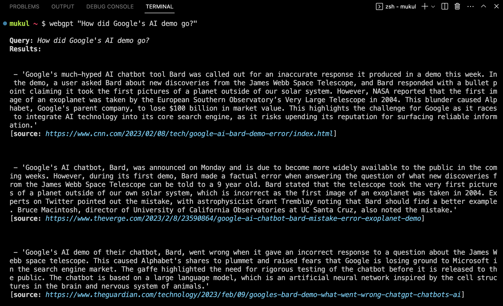

# webgpt-cli

A cli that recreates webgpt through multi shot prompting. Uses beautifulsoup, serpapi, and gpt-3.


## Installation

```bash 
git clone https://github.com/mukulpatnaik/webgpt-cli.git
cd webgpt-cli
pip install -r requirements.txt
```

## Usage

```bash
python webgpt.py "your query"
```

### To use as a single command add this alias in your .bashrc or .zshrc

```bash
alias webgpt="python /path/to/webgpt.py"
```

### and then call it like this

```bash
webgpt "your query"
```

### To call the plain gpt-3 api from the command line add this alias in your .bashrc or .zshrc

```bash
alias gpt="python /path/to/gpt3.py"
```

### and then call it like this

```bash
gpt "your query"
```

## Example Screenshot

